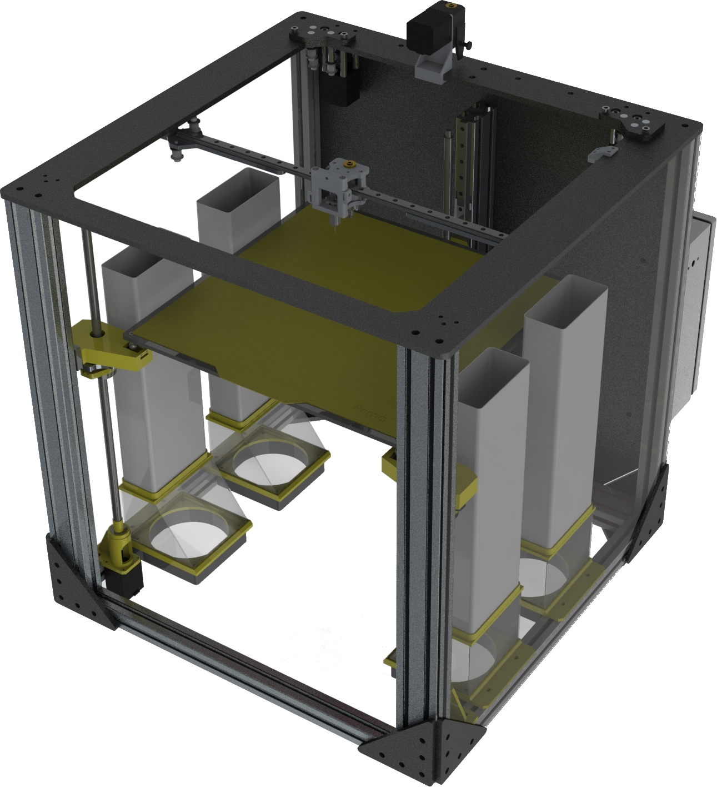

# xy3z 3D printer

3D printer based on Toolchanger.

Featured:

- Duet 3 mainboard 6HC
- Raspberry Pi 4 as SBC to allow more functionality
- Mosquito Magnum+ Hotend by Slice Engineering
- CHT nozzle by Bondtech
- BLTouch as Z probe
- Airflow control by Noctua

Features:

- CoreXY
- Kinematic bed
- 3 indipendet motor for Z axis
- 230Vac bed heater controlled by SSR via PWM
- Web dashboard

This project is till in under development.
